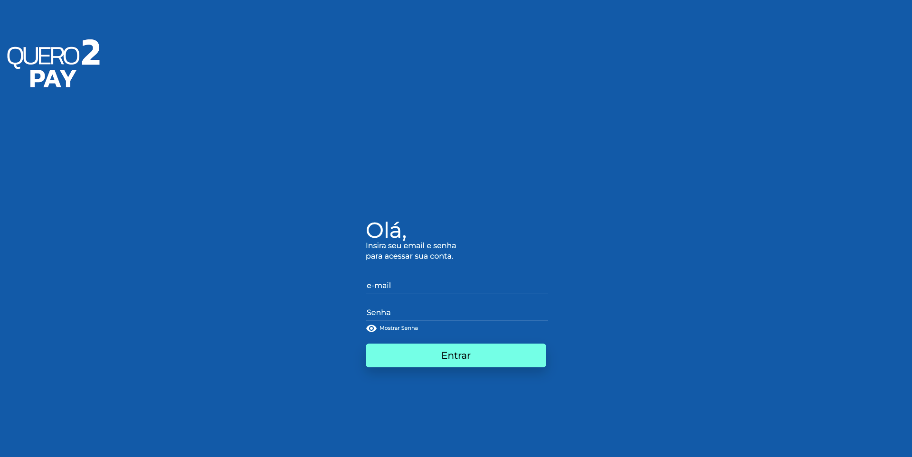
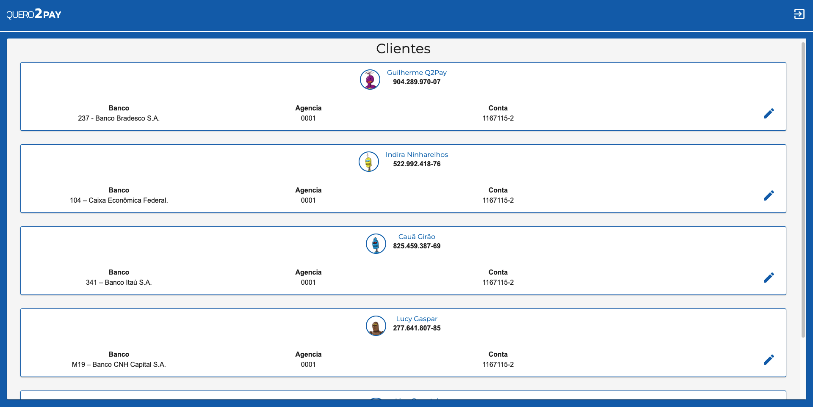
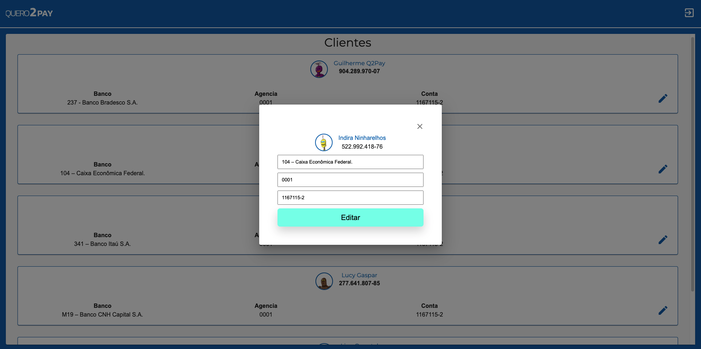
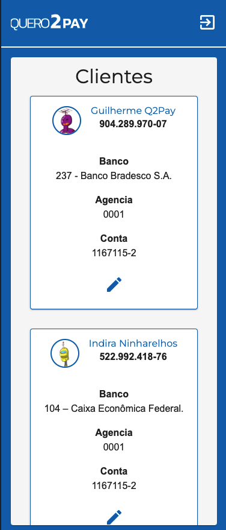
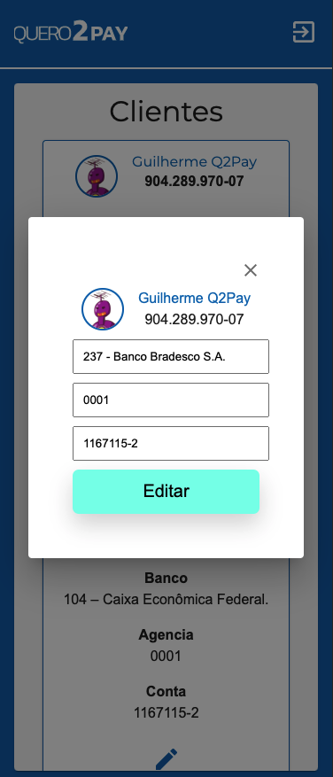

Q2 PAY Frontend Code Challenge.

Imagens no DESKTOP:.

  
  
  

Imagens no MOBILE:.

  
  
  

<!-- What is: -->

## Explicando um pouco o projeto

foi utilizado uma mock api, hospedada no heroku: [mock-api](https://mock-api-peoples.herokuapp.com)

O projeto consiste em uma tela de Login e listagem.

para logar utilize o acesso:

email : lucas@email.com
senha: lucas

Após login, deve ser listado uma base de clientes, com possibilidade de edição.

Essa listagem possuí uma paginação com scroll infinito.

O projeto está disponível no link: [Q2TEST](https://q2test.vercel.app/)

## Padrões de commit

Todos os commits do projeto foram baseados no conventional-commits e para mantermos o mesmo padrão para todos os commits que serão realizados no projeto foram utilizadas algumas libs:

Husky: O Husky vai nos ajudar a criarmos ganchos para o Git de uma maneira simples. Os ganchos são ações que vão ser disparadas em determinados momentos. Nesse caso, vamos criar um gancho para ser disparado antes de um commit ser inicializado.
Dessa maneira, sempre que fizermos um commit, vamos configurar o Husky para executar o Commitlint e verificar se a mensagem do commit está seguindo os padrões recomendados.

Commitlint: Com ele conseguimos verificar se a mensagem de commit que escrevemos realmente está dentro dos padrões pré definidos. Vamos usar os padrões do Angular, mas ele pode ser alterado e podemos até mesmo criar o nosso próprio padrão.

<!-- Links: -->

## Getting started

1. Install
   [Git](http://git-scm.com/downloads) e
   [NodeJS](http://nodejs.org/download/),

2. Clone repository:

   sh
   \$ git clone https://github.com/passeto/q2test

3) Go to project folder:

   sh
   \$ cd q2test

5. Install all dependences:

   sh
   \$ npm i

6) Finally run:

    sh
   \$ npm dev

<!-- Create by: -->

## Who's behind this?

Developer passionate about programming and technologies.

_Create by_:

- [Luccas Passeto](http://github.com/passeto)